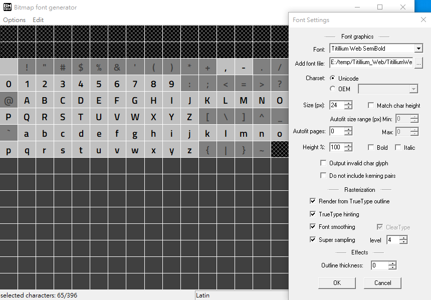
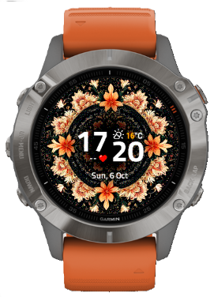

## Disclaimer: This is a copy of [Kai Hao's blogpost](https://kaihao.dev/posts/Develop-a-Garmin-watch-face) on developing a garmin watchface (for archival purpose).


Recently, I was curious enough to try developing a custom watch face for my Garmin watch. I spent 3 days building the [watch face](https://apps.garmin.com/apps/90148ba3-bff9-45d4-889e-c7ac2d3c636f) after reading Kai Hao's tutorial, and it was a fun experience. Read along if you are curious or also want to try it out.

## Design

I decided I only needed a few things on my watch face:

- Time (hours/minutes/date)
- Battery (only when it's low)
- Heart rate
- Weather (coz Scotland)
- A unique design to surround the data.

Since I was only interested in designing for my watch model, the only device I could get my hands on, I didn't bother trying to make the design work on other devices, which saved me a lot of trouble.

## Code

After deciding the basic design of the watch face, I read through the basics of the [official documentation](https://developer.garmin.com/connect-iq/overview/) and started up a project as soon as possible to get my hands dirty. They use an entirely different programming language called ["Monkey C"](https://developer.garmin.com/connect-iq/monkey-c/) which I obviously had no knowledge of. Fortunately, it's not very different than Java or JavaScript, so you don't need to have any experience with the language.

I was using the official [Monkey C VSCode extension](https://marketplace.visualstudio.com/items?itemName=garmin.monkey-c), which essentially turns your VSCode into an IDE for developing Garmin apps. Just follow the instructions to set it up.

The most important file in the project is the one named `[YOUR_WATCH_FACE_NAME]View.mc` in the `source` directory. It controls the _view_ of the watch face, and we will be implementing most of the features in this file. The file has a class with the same name and contains some public methods, we'll only be using some of them though.

```java
// Import classes from the SDK
import Toybox.WatchUi;
import Toybox.Graphics;

class MyWatchFaceView extends WatchUi.WatchFace {
  function initialize() {
    // The constructor of the class
  }

  function onLayout() {
    // The entry point of the watch face, we can load our resources here
  }

  function onUpdate(dc as Graphics.Dc) {
    // Update and redraw the watch face view
  }
}
```

Drawing the watch face is done by calling methods of `Graphics.Dc` in `onUpdate`. You might find it easier to understand if you're familiar with HTML Canvas. For instance, the code below will draw the text "Hello World" in the center of the watch face.

```java
function onUpdate(dc) {
  // Set the color before drawing the text
  dc.setColor(
    Graphics.COLOR_WHITE, // Using white as foreground color
    Graphics.COLOR_TRANSPARENT // Using transparent as background color
  );

  // Draw the text on the screen
  dc.drawText(
    dc.getWidth() / 2, // The x coordinate
    dc.getHeight() / 2, // The y coordinate
    Graphics.FONT_MEDIUM, // Using the default font with medium size
    "Hello World", // The text to draw
    Graphics.TEXT_JUSTIFY_CENTER | Graphics.TEXT_JUSTIFY_VCENTER // Justify to center both horizonatally and vertically using bitmap mask
  );
}
```

`Dc` stands for Device Context, and it provides some other methods we can use to draw things on the watch face. Refer to the [official API documentation](https://developer.garmin.com/connect-iq/api-docs/Toybox/Graphics/Dc.html) for available methods.

## Resources

The design isn't only about texts or shapes though, we'd like to load other **resources** and draw them on the watch face as well. For instance, I have a background image in my design, and I also want to use my custom fonts rather than the default ones.

### Images

We can save our images into the `resources/drawables` directory, and edit the `drawables.xml` file.

```xml
<drawables>
  <bitmap id="MyImage" filename="my-image.png" />
</drawables>
```

This tells the app to look for the `my-image.png` bitmap file and assign the id `MyImage` to it. We can then later load the image in our code.

```java
import Toybox.Application;

class MyWatchFaceView extends WatchUi.WatchFace {
  // Define a private variable for the instance
  private var myImage;

  function initialize() {
    // Call the parent constructor
    WatchFace.initialize();

    // Load the resource "MyImage" from "drawables" into the `myImage` variable
    myImage = Application.loadResource(Rez.Drawables.MyImage);
  }

  function onUpdate(dc) {
    // Call the parent onUpdate function to redraw the layout
    View.onUpdate(dc);

    // Draw the image on the top left corner ([x, y] == [0, 0])
    dc.drawImage(0, 0, myImage);
  }
}
```

Note that you can't change the size of the image, so if you'll have to make sure the size is correct, or scale it accordingly in `drawables.xml`.

### Fonts

Loading fonts is similar but requires a bit more setups. First, find a font and download it on your computer. I'm using [**Titillium Web**](https://fonts.google.com/specimen/Titillium+Web) but you can use any. Next, we have to download [BMFont](https://www.angelcode.com/products/bmfont/) to convert our font into a bitmap-based resource. The program is only available on Windows though and I don't know if there's something similar on Mac or Linux.

We then can choose which characters we want to include in the font file since that smartwatch is very resource-limited and bundling the whole font might be too consuming. Font settings can let us select the font and determine its size and other settings. Yes, each size of the same font will be a different output font file, which is a very tedious process.



Once it's done, you can export the output to the `resources/fonts` folder. There should be a `.fnt` file and a `.png` file. Create a `fonts.xml` file under the same folder with the following content.

```xml
<fonts>
  <font id="MyFont" filename="my-font.fnt" />
</fonts>
```

Then you can load your font in your code just like loading the images and use it with `drawText`.

```java
// Load it in `initialize` or `onLayout`
myFont = Application.loadResource(Rez.Fonts.MyFont);
```

## Data

Now that we have our resources ready, we just need to get the data and draw them on the watch face. The SDK provides APIs to get the data we need, here are some examples:

```java
import Toybox.System;
import Toybox.Activity;
import Toybox.ActivityMonitor;
using Toybox.Time.Gregorian as Date;

private function getHoursMinutes() {
  var clockTime = System.getClockTime();
  var hours = clockTime.hour.format("%02d"); // 2-digit hours (24h)
  var minutes = clockTime.min.format("%02d"); // 2-digit minutes
  // Seconds is similar:
  // var seconds = clockTime.sec.format("%02d"); // 2-digit seconds
  return [hours, minutes];
}

private function getDate() {
  // Get the current time
  var now = Time.now();
  // Extract the date info, the strings will be localized
  var date = Date.info(now, Time.FORMAT_MEDIUM); // Extract the date info
  // Format the date into "ddd, MMM, D", for instance: "Thu, Jan 6"
  var dateString = Lang.format("$1$, $2$ $3$", [date.day_of_week, date.month, date.day]);
  return dateString;
}

private function getHeartRate() {
  // initialize it to null
  var heartRate = null;

  // Get the activity info if possible
  var info = Activity.getActivityInfo();
  if (info != null) {
    heartRate = info.currentHeartRate;
  } else {
    // Fallback to `getHeartRateHistory`
    var latestHeartRateSample = ActivityMonitor.getHeartRateHistory(1, true).next();
    if (latestHeartRateSample != null) {
      heartRate = latestHeartRateSample.heartRate;
    }
  }

  // Could still be null if the device doesn't support it
  return heartRate;
}

private function getBattery() {
  var battery = System.getSystemStats().battery;
  return battery;
}
```

## Stitching together

You can find the final source code on [GitHub](https://github.com/shyamjesal/minimal).



## Publishing

The final step is to publish it to the [Connect IQ store](https://apps.garmin.com/en-US/) so that it can be downloaded by others. This is optional though, and you can always just side-load the watch face directly to your device.

The process is straightforward, just export your project to a `.iq` file and
follow the [instructions](https://developer.garmin.com/connect-iq/submit-an-app/) to upload it. The initial version will need to be manually reviewed by Garmin, but I got mine approved very quickly in under a day. And, that's it! Your watch face is now on the store and available for download!

Even though the app still has lots to improve (like sometimes the animations don't work as expected), but in general I'm pretty satisfied with the result. This also opens up a lot more opportunities for my next side-project idea, maybe I can build a watch app next for instance.

Now it's your turn to build your own watch face and tell me about it!